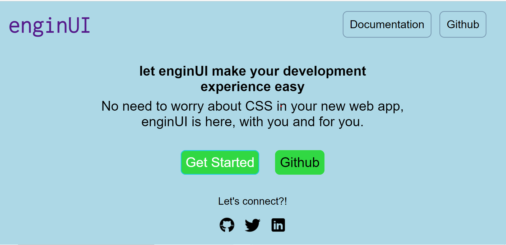

# enginUI

let enginUI make your web dev. experience easy. enginUI is here, with you and for you.

## Get Started


```http
      <link rel="stylesheet" 
      href="https://engin-ui.netlify.app/components/style.css">
```

## Components

The available components are as follows.

1.  [Avatar](https://engin-ui.netlify.app/documentation/landing-components/avatar/avatar.html)
2. [Alert](https://engin-ui.netlify.app/documentation/landing-components/alert/alert.html)
3. [Badge](https://engin-ui.netlify.app/documentation/landing-components/badge/badge.html)
4. [button](https://engin-ui.netlify.app/documentation/landing-components/button/button.html)
5. [Card](https://engin-ui.netlify.app/documentation/landing-components/card/card.html)
6. [image](https://engin-ui.netlify.app/documentation/landing-components/image/image.html)
7. [Input](https://engin-ui.netlify.app/documentation/landing-components/input/input.html)
8. [Text utilities](https://engin-ui.netlify.app/documentation/landing-components/text-util/text-util.html)
9. [Lists](https://engin-ui.netlify.app/documentation/landing-components/lists/list.html)
10. [Navigation](https://engin-ui.netlify.app/documentation/landing-components/navigation/navigation.html)
11. [Modal](https://engin-ui.netlify.app/documentation/landing-components/modal/modal.html)
12. [Rating](https://engin-ui.netlify.app/documentation/landing-components/rating/rating.html)
13. [toast](https://engin-ui.netlify.app/documentation/landing-components/toast/toast.html)
14. [snackbar](https://engin-ui.netlify.app/documentation/landing-components/snackbar/snackbar.html)
15. [simplified grid](https://engin-ui.netlify.app/documentation/landing-components/simplified-grid/grid.html)


## Documentation

 [Documentation](https://engin-ui.netlify.app/documentation/get-started/getstarted)

1.  [Avatar](https://engin-ui.netlify.app/documentation/landing-components/avatar/avatar.html)
  
* image Avatar.
* text avatar.
* Rounded , square and curved.

2. [Alert](https://engin-ui.netlify.app/documentation/landing-components/alert/alert.html)

* Small, medium, Large and extrea-large alert 
* Alert with different colors.
* Rounded Alert

3. [Badge](https://engin-ui.netlify.app/documentation/landing-components/badge/badge.html)

* colored badges.
* Rext badge
* Small, medium, large and extra large badge.

4. [button](https://engin-ui.netlify.app/documentation/landing-components/button/button.html)

* Primary, Disabled , Outline and link button
* Only text, text with icon, only icon button.

5. [Card](https://engin-ui.netlify.app/documentation/landing-components/card/card.html)

* Simple Card
* Card with text overlay.
* Text overlay with dismiss button.
* Card with no footer. 
* Card with no description

6. [image](https://engin-ui.netlify.app/documentation/landing-components/image/image.html)

* Responsive image
* Image rounded
* Image square
7. [Input](https://engin-ui.netlify.app/documentation/landing-components/input/input.html)
* Simple input with button.
* Success input with button.
* Error input with button 
* Input with icon .
8. [Text utilities](https://engin-ui.netlify.app/documentation/landing-components/text-util/text-util.html)
* h1
* h2
* h3
* h4
* h5
* h6 
* paragraph small.
* paragraph medium.
* paragraph large.
* underlined.
* line-through.
9. [Lists](https://engin-ui.netlify.app/documentation/landing-components/lists/list.html)
* Simple list.
* List style circle.
* List style square .
* List style small-alpha.
* List style big alpha.
* List style small roman.
* List style capital roman.
10. [Navigation](https://engin-ui.netlify.app/documentation/landing-components/navigation/navigation.html)
* Navbar with links.
* Navbar with icons.
11. [Modal](https://engin-ui.netlify.app/documentation/landing-components/modal/modal.html)
* Simple Modal.
* Column modal.
* Confirmation modal.
12. [Rating](https://engin-ui.netlify.app/documentation/landing-components/rating/rating.html)
* Simple rating components.
13. [toast](https://engin-ui.netlify.app/documentation/landing-components/toast/toast.html)
 * Small toast
 * medium toast
 * large toast
 * Success error and pending (colors)
 14. [snackbar](https://engin-ui.netlify.app/documentation/landing-components/snackbar/snackbar.html)

 * Simple snackbar
 * Stacked snackbar 

 ## Video
 [gif](./assets/screen-capture.gif)